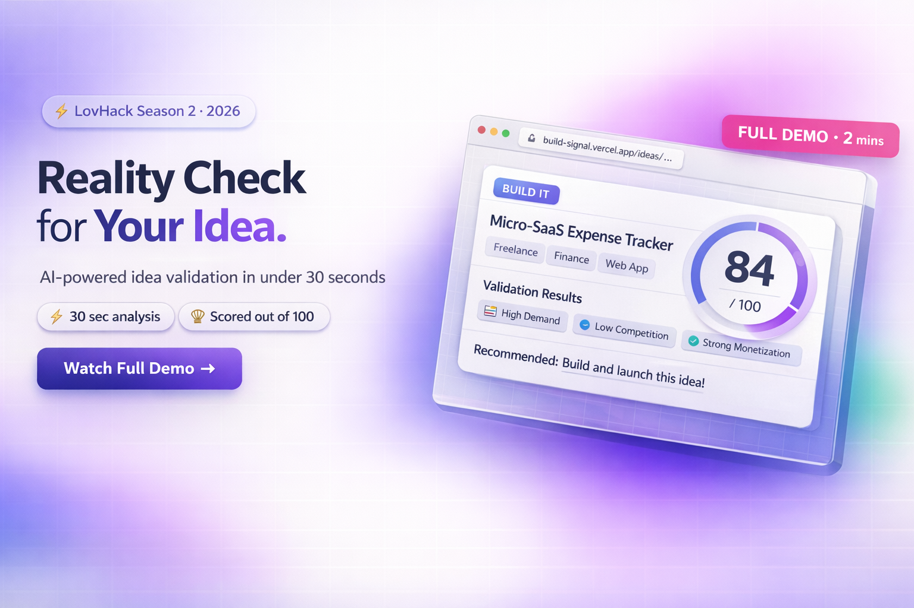

<div align="center">

# 🚀 BuildSignal

### Your idea's permanent reality check.

<p align="center">
  <a href="https://build-signal.vercel.app/" style="text-decoration:none;">
    
  </a><!--
  --><a href="https://github.com/JexanJoel/Build-Signal" style="text-decoration:none;">
    
  </a><!--
  --><a href="./LICENSE" style="text-decoration:none;">
    
  </a>
</p>

</div>

---

## 🏆 LovHack Season 2 Submission

BuildSignal was built from scratch during **LovHack Season 2** - a 7 day global online hackathon challenging builders to ship real, working products using modern AI tools.

---

## 🎬 Demo

> Click the thumbnail below to watch the demo

[](https://youtu.be/xPcak0N0Cag)

---

## 📸 Screenshots

### Landing Page

*Clean first impression with product pitch, core value, and clear call-to-action*


### Login

*Simple authentication flow for users to sign in and start validating ideas*


### New Analysis

*Describe your idea, set your target users, and pick an analysis mode*


### Dashboard

*All your saved analyses in one place - scores, verdicts, and history at a glance*


### Analysis Result

*Full structured breakdown - strengths, risks, MVP scope, validation steps, and a final verdict*


---

## ✨ What is BuildSignal?

**BuildSignal** is an AI-powered idea validation platform for builders, indie hackers, students, and developers who want honest feedback before committing weeks to the wrong product.

Submit your concept. Get a **structured, scored, plain-English analysis** covering clarity, risk, market opportunity, MVP scope, validation steps, and a final recommendation - all in under 30 seconds.

It answers one simple question:

> **Should I build this, improve it, or move on?**

---

## 🧠 The Problem

Most product ideas sound exciting - until reality sets in:

- The target user was never clearly defined
- The market is too crowded
- The MVP is too broad to ship
- The assumptions never held up
- Weeks of effort went into the wrong thing

**Builders don't fail because they can't code. They fail because they build the wrong thing.**

BuildSignal solves that before a single line of code is written.

---

## 💡 The Solution

BuildSignal gives every idea a fast, structured AI review so builders can:

- Understand who the product is actually for
- Spot hidden risks and weak assumptions early
- Define a smaller, smarter MVP
- Get concrete validation steps to test demand
- Receive a final verdict they can act on immediately

Instead of vague chatbot output, the platform returns a **clear verdict with a scored breakdown** users can actually use.

---

## 🔥 Core Features

<div align="center">

| Feature | Description |
|:---|:---|
| ⚡ **Instant AI Analysis** | Complete structured review in under 30 seconds |
| 🎯 **User Clarity Score** | Measures how well-defined your target audience is |
| 🛡️ **Risk Detection** | Surfaces weak assumptions and failure points early |
| 🗺️ **MVP Scope Planner** | Turns messy ideas into a focused, buildable first version |
| ✅ **Validation Steps** | Actionable ways to test demand before building |
| 💾 **Dashboard History** | Save and revisit analyses as your thinking evolves |
| 📊 **Idea Scoring** | Each idea scored out of 100 across multiple dimensions |
| 🧪 **3 Analysis Modes** | Quick - Deep - Savage: choose your feedback intensity |
| 📌 **Clear Verdict** | BUILD IT - NEEDS WORK - RISKY - PASS |

</div>

---

## 🧪 3 Analysis Modes

<div align="center">

| Mode | Description |
|:---|:---|
| ⚡ **Quick** | Fast overview with key insights |
| 🔍 **Deep** | Thorough breakdown across all 8 dimensions |
| 🔥 **Savage** | Brutally honest - no filter, no sugar coating |

</div>

---

## 🏗️ How It Works

```
1. Describe your idea
   -> Title, target user, problem statement, and concept in plain English

2. Choose analysis mode
   -> Quick, Deep, or Savage depending on how much detail you need

3. Get your verdict
   -> Scored analysis across strengths, weaknesses, risks, MVP scope,
      market opportunity, validation steps, and final recommendation

4. Save and iterate
   -> All analyses saved to your dashboard to revisit and improve over time
```

---

## 🧾 Example Output

<div align="center">

| Idea | Score | Verdict |
|:---|---:|:---|
| Micro-SaaS expense tracker for freelancers | 84/100 | 🚀 BUILD IT |
| AI chatbot for restaurants | 58/100 | 🔧 NEEDS WORK |
| Crypto portfolio tracker | 29/100 | ❌ PASS |

</div>

---

## 🛠️ Tech Stack

<div align="center">

| Layer | Technology |
|:---|:---|
| **Frontend** | React, TypeScript, Tailwind CSS, React Router |
| **Backend** | Supabase - auth, database, edge functions |
| **AI** | Groq API + Llama 3.3 70B |
| **Hosting** | Vercel |

</div>

---

## 📁 Project Structure

```
src/
├── components/         # Shared UI components
├── hooks/              # useAuth, useIdeas, useDeleteIdea
├── pages/
│   ├── Landing.tsx     # Marketing landing page
│   ├── Dashboard.tsx   # Saved ideas overview + stats
│   ├── NewAnalysis.tsx # Idea submission form
│   └── IdeaDetail.tsx  # Full analysis result view
├── lib/
│   └── supabase.ts     # Supabase client
└── types/              # AnalysisResult and shared types

supabase/
└── functions/
    └── analyze-idea/   # Edge function calling Groq API
```

---

## 🚀 Getting Started

```bash
# Clone the repo
git clone https://github.com/JexanJoel/Build-Signal
cd Build-Signal

# Install dependencies
npm install

# Set up environment variables
cp .env.example .env
# Add your SUPABASE_URL, SUPABASE_ANON_KEY, and GROQ_API_KEY

# Start the dev server
npm run dev
```

---

## 🧠 Why BuildSignal Stands Out

This is not another "ask AI about my idea" chatbot.

BuildSignal is built around a **real workflow**:

```
idea  ->  analysis  ->  verdict  ->  save  ->  improve
```

It focuses on:

- **Structured output** over generic text
- **Decision making** over novelty
- **Builder usefulness** over AI hype
- **Speed and clarity** over complexity

The result is a tool that is practical, fast to demo, and solves a real problem that every builder faces - deciding what is actually worth building.

---

## 🎯 Built For

- Indie hackers and solo founders
- Hackathon builders
- Students exploring startup ideas
- Developers testing product concepts
- Makers who want fast, honest feedback

---

## 📄 License

<div align="center">

[](./LICENSE)

</div>

---

<div align="center">

Built during **LovHack Season 2** - March 2026


</div>